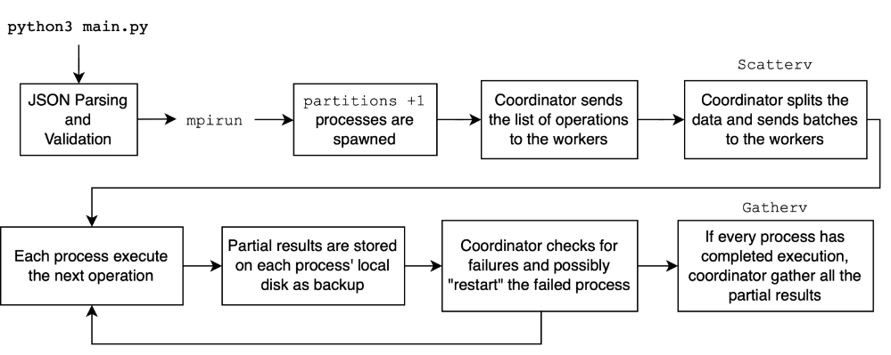

# Fault-Tolerant Dataflow Platform
Fault-tolerant dataflow platform implementation for the distributed systems course of the Polytechnic of Milan.

## Project Description
The platform is implemented for processing key-value pairs where keys and values are integers. The platform offers three operators, which are executed independently and in parallel for each key `k`:
- `map(f: int -> int)`: for each input tuple `<k, v>`, it outputs a tuple `<k, f(v)>`
- `changeKey(f: int -> int)`: for each input tuple `<k, v>`, it outputs a tuple `<f(v), v>`
- `reduce(f: list<int> -> int)`: takes in input the list `V` of all values for key `k`, and outputs `<k, f(V)>`

The platform includes a **coordinator** and multiple **workers**. The coordinator accepts **dataflow programs** specified as an arbitrarily long sequence of the above operators. Programs are defined in a JSON file provided as input. Each operator is executed in parallel over multiple partitions of the input data, where the number of partitions is specified as part of the dataflow program. The coordinator splits the input data among processes and sends the operations set. Input data is split among processes based on the key. Thanks to this approach key-value pairs with the same key are located into the same process.

The systems implements a fault-tolerance mechanism that limit the amount of work that needs to be be re-executed in the case a worker fails. This is achieved by saving a dump file containing the partial results computed until the failure. The coordinator keeps track of the operations computed by each worker and then tells it the point in the operations set it executed.



The project uses [Open MPI](https://www.open-mpi.org) and [mpi4py](https://mpi4py.readthedocs.io/en/stable/) as middleware for distributed computing.

## Setup Guide
### Conda
Install conda
Create a new environment
```bash
conda create -n fault-tolerant-dataflow python=3.9
```
Activate the environment
```bash
conda activate fault-tolerant-dataflow
```
Install requirements
```bash
pip install -r requirements.txt
```

## How to Run
```bash
python main.py -c|--Config <config_file> [-h|--Hosts host(,host)*] [-n|--NoFault]
```
- `config_file`: path to the JSON file containing the dataflow program
- `hosts`: list of hosts to use for the computation. If not specified, the computation is run locally. An example of hosts list is `machine1, machine2, machine3`, where those names are saved in the `/etc/hosts` file of the machine running the program. Remember that in order to run the program in a distributed environment, the machines must be connected via ssh and without password.
Keep in mind that if you need to run the program in a distributed environment, you must have the same version of the code on all the machines and in the same path. This means that the code must be copied on all the machines that will be used for the computation. The machines must be connected via ssh and without password. The `/etc/hosts` file must contain the names of the machines that will be used for the computation.
Be sure to have the same version of the code on all the machines and in the same path.